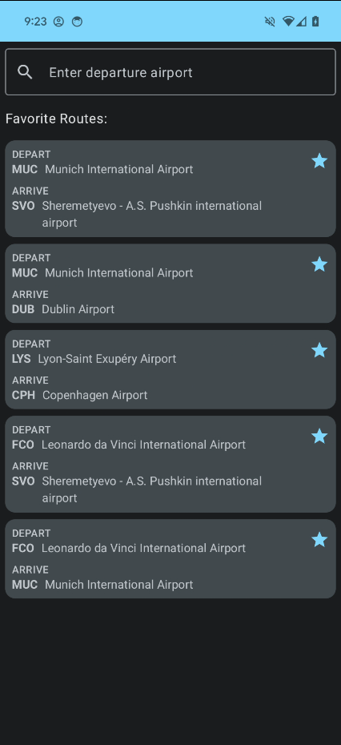
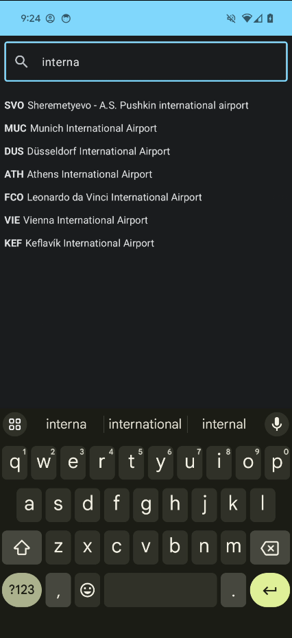
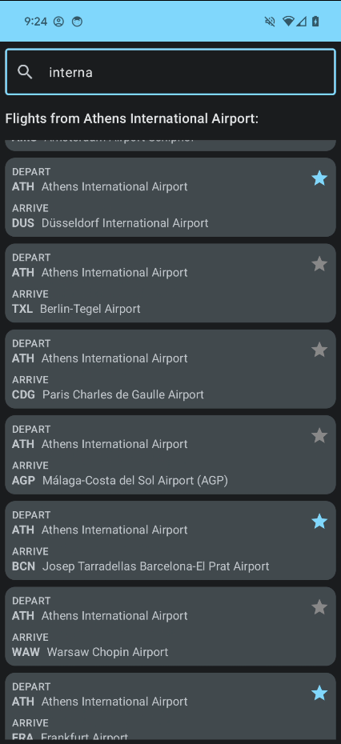

## Flight Search Codelab

Disclaimer: Please note that this project is from the [Android Basics with Compose](https://developer.android.com/courses/pathways/android-basics-compose-unit-6-pathway-3) course and was created for learning purposes only.

### Images
 &nbsp; &nbsp; &nbsp; &nbsp;  &nbsp; &nbsp; &nbsp; &nbsp; 

### Features
* Search for airports based on either name or IATA code
* Add and remove favorite routes with persistence
* Display favorite routes when search bar is empty
* Persist search bar contents between app launches

### Tools
* Room Database
* Preferences DataStore
